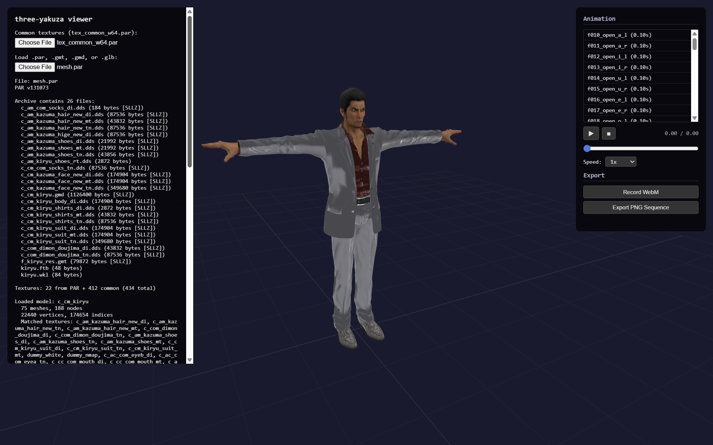
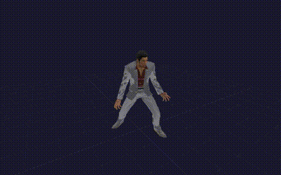

# `three-yakuza`

Use [Yakuza / Like a Dragon](https://rggstudio.sega.com/) assets in [three.js](https://github.com/mrdoob/three.js)

[GitHub Repository](https://github.com/tonybolivar/three-yakuza/) | [Examples](https://github.com/tonybolivar/three-yakuza/tree/main/examples) | [Contributing](CONTRIBUTING.md)



> **Early development** -- This project is a work in progress. Model rendering has known issues including facial shading artifacts, missing material features, incomplete facial animation blending, and a plethora of other things I probably didn't notice. Contributions welcome!

## What is this?

The first browser-native loader for SEGA's proprietary RGG Studio asset formats. Parse and render Yakuza series models, animations, and textures directly in Three.js with no Blender pipeline required.



## Packages

| Package | Description |
| --- | --- |
| [`@three-yakuza/gmt-parser`](packages/gmt-parser) | Parse GMT/CMT/IFA files (zero dependencies) |
| [`@three-yakuza/gmd-parser`](packages/gmd-parser) | Parse GMD model files (zero dependencies) |
| [`@three-yakuza/par-parser`](packages/par-parser) | Unpack PAR archives + SLLZ decompression (zero dependencies) |
| [`@three-yakuza/three-gmt`](packages/three-gmt) | Three.js GMT animation loader |
| [`@three-yakuza/three-gmd`](packages/three-gmd) | Three.js GMD model loader with PBR materials |

## Supported formats

| Format | Extension | Contents | Games |
| --- | --- | --- | --- |
| GMT | `.gmt` | Skeletal animations (body, face) | Y0, YK1, Y3-5, Kenzan, Ishin |
| CMT | `.cmt` | Camera animations | Y0, YK1, Y3-5, Kenzan, Ishin |
| IFA | `.ifa` | Facial pose data | Y0, YK1, Y3-5 |
| GMD | `.gmd` | Character/stage models with skinning | Y0, YK1, Y3-5 |
| PAR | `.par` | Asset archives | All Old Engine titles |
| DDS | `.dds` | Textures (DXT1/DXT5) | All Old Engine titles |

## Features

- Full skinned mesh rendering with bone animation
- PBR materials with SEGA-specific shader patches (green normal maps, multi-maps)
- Texture slot-based material assignment (diffuse, normal, multi-map, repeat textures)
- Bone palette vertex welding for seamless mesh rendering
- Cross-mesh normal smoothing at material boundaries
- Animation player with timeline scrubber and speed control
- WebM recording and PNG sequence export

## Quick start

### Install via npm

```sh
npm install three @three-yakuza/three-gmt @three-yakuza/three-gmd
```

### Or clone and build from source

```sh
git clone https://github.com/tonybolivar/three-yakuza.git
cd three-yakuza
pnpm install
pnpm build
```

### Load a GMD model from a PAR archive

```typescript
import { parsePAR, extractFile } from '@three-yakuza/par-parser';
import { GMDLoader } from '@three-yakuza/three-gmd';

// Load common textures first (shared across characters)
const commonPar = await fetch('/data/tex_common_w64.par').then(r => r.arrayBuffer());
const loader = new GMDLoader();
loader.setCommonTextures(loadDDSFromPAR(commonPar));

// Load character PAR
const parBuffer = await fetch('/data/c_cm_kiryu/mesh.par').then(r => r.arrayBuffer());
const archive = parsePAR(parBuffer);

// Extract and parse the GMD model
const gmdFile = archive.files.find(f => f.name.endsWith('.gmd'));
const gmdData = extractFile(parBuffer, gmdFile);
const result = loader.parse(gmdData.buffer);

scene.add(result.scene); // SkinnedMesh with skeleton
```

### Load and play a GMT animation

```typescript
import { GMTLoader } from '@three-yakuza/three-gmt';

const gmtLoader = new GMTLoader();
const gmt = await gmtLoader.loadAsync('/animations/p_krc_wpc_atk_pickup_l.gmt');

const mixer = new THREE.AnimationMixer(result.scene);
mixer.clipAction(gmt.animations[0]).play();
```

### Parser only (no Three.js)

```sh
npm install @three-yakuza/gmt-parser
```

```typescript
import { parseGMT } from '@three-yakuza/gmt-parser';

const buffer = await fetch('/animations/idle.gmt').then(r => r.arrayBuffer());
const gmt = parseGMT(buffer);

console.log(gmt.name);                    // file name
console.log(gmt.animations[0].name);       // animation name
console.log(gmt.animations[0].frameRate);  // e.g. 30.0
console.log(gmt.animations[0].bones);      // Map<string, GMTBone>
```

## Viewer

The [`examples/gmt-viewer`](examples/gmt-viewer) is a full-featured browser viewer with:

- PAR archive loading (auto-extracts models, textures, animations)
- Animation clip list with click-to-play
- Timeline scrubber with playback speed control
- Orbit camera + WASD free-fly mode (Tab to toggle)
- WebM video recording and PNG sequence export
- Common texture loading (tex_common_w64.par)

```sh
cd examples/gmt-viewer
pnpm dev
```

## Texture formats

The SEGA Old Engine uses several texture types identified by suffix:

| Suffix | Purpose |
| --- | --- |
| `_di` | Diffuse / albedo (alpha = transparency) |
| `_tn` | Normal map (green channel format: X in alpha, Y in green, Z derived) |
| `_mt` | Multi-map: R=metallic, G=ambient occlusion, B=glossiness |
| `_rd` | Repeating diffuse overlay (secondary UV) |
| `_rt` | Repeating normal map (secondary UV) |
| `_ts` | Wrinkle / toon-subsurface map |
| `_tr` | Subsurface scattering map |

## Bone naming

Animation clips use original SEGA bone names as-is. This library does **not** perform bone retargeting. If applying GMT animations to non-Yakuza models (MMD, VRM, custom rigs), you must map bone names in your own code.

Common SEGA bone names: `center_c_n`, `kosi_c_n`, `mune_c_n`, `kubi_c_n`, `face_c_n`, `kata_r_n`, `ude_r_1_n`, `te_r_n`, `asi1_r_n`

## Credits

Parser logic ported from:

- [`gmt_lib`](https://github.com/SutandoTsukai181/gmt_lib) by SutandoTsukai181 - GMT/CMT/IFA parsing
- (ParManager) by Kaplas80 - PAR archive unpacking
- [`yk_gmd_io`](https://github.com/theturboturnip/yk_gmd_io) by theturboturnip - GMD model parsing

Texture format documentation from the Yakuza modding community.

## Contributing

See [CONTRIBUTING.md](CONTRIBUTING.md).

## License

[MIT](LICENSE)
